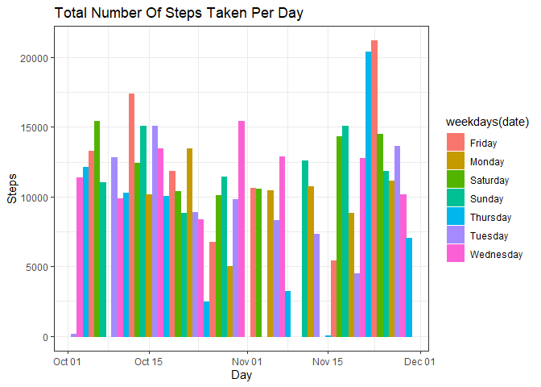
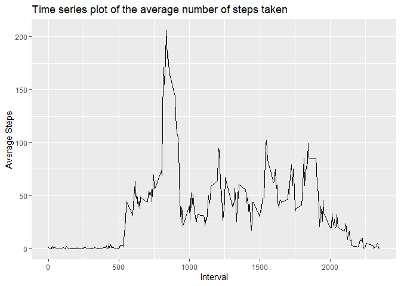
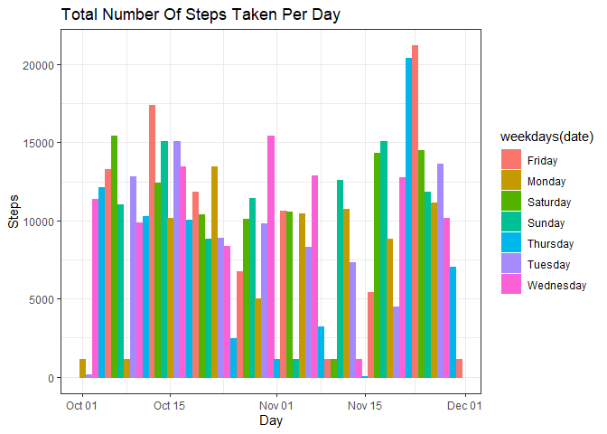
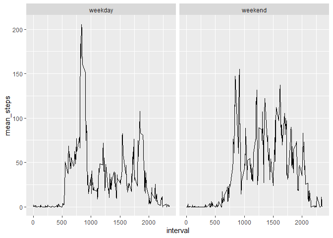

## 1. Loading and preprocessing the data


```r
knitr::opts_chunk$set(echo = TRUE)

  library(dplyr)
```

```
## 
## Attaching package: 'dplyr'
```

```
## The following objects are masked from 'package:stats':
## 
##     filter, lag
```

```
## The following objects are masked from 'package:base':
## 
##     intersect, setdiff, setequal, union
```

```r
  library(ggplot2)
  
  act <-  read.csv(unzip(zipfile = "activity.zip", files = "activity.csv"))
  act$date <- as.Date(act$date)
```
### Using Library dplyr and ggplot2 which will be required
### Reading the CSV and using as.Date to transform Dates to the required format


### Calculating The Total Number of Steps taken per day by aggregate

```r
knitr::opts_chunk$set(echo = TRUE)

  steps_per_day <- aggregate(steps ~ date, act, sum)
```


## 2. Histogram of the total number of Steps taken each day using ggplot


```r
knitr::opts_chunk$set(echo = TRUE)

  ggplot(data = act, aes(date, steps, col = weekdays(date), fill = weekdays(date)))+ 
    geom_bar(stat = "identity")+
    theme_bw()+
    labs(title = "Total Number Of Steps Taken Per Day")+ 
    labs(x = "Day", y = "Steps")
```

```
## Warning: Removed 2304 rows containing missing values (position_stack).
```

<!-- -->

## 3. Calculating Mean and Median number of steps taken each day


```r
knitr::opts_chunk$set(echo = TRUE)

  mean <- mean(steps_per_day$steps)
  median <- median(steps_per_day$steps)
```

## The value of which are:
## Mean: 1.0766189\times 10^{4} and Median: 10765 


### Saving the plot as png in the sub folder figures


```r
knitr::opts_chunk$set(echo = TRUE)


  png(filename="./figures/1_Histogram_of_the_total_number_of_steps_taken_each_day.png", width=480, height=480, units="px")
  
        ggplot(data = act, aes(date, steps, col = weekdays(date), fill = weekdays(date)))+ 
          geom_bar(stat = "identity")+
          theme_bw()+
          labs(title = "Total Number Of Steps Taken Per Day")+ 
          labs(x = "Day", y = "Steps")
```

```
## Warning: Removed 2304 rows containing missing values (position_stack).
```

```r
  dev.off()
```

```
## png 
##   2
```


## 4. time series plot of the 5-minute interval (x-axis) and the average number of steps taken, averaged across all days (y-axis)


```r
knitr::opts_chunk$set(echo = TRUE)


  interval_steps <- act%>%select(interval,steps)%>%group_by(interval)%>%summarise(mean(steps,na.rm=TRUE))
  colnames(interval_steps)<-c('interval','avg_steps')
  
  ggplot(interval_steps, aes(interval, avg_steps))+ 
    geom_line()+
    labs(title = "Time series plot of the average number of steps taken")+
    labs(x = "Interval", y= "Average Steps")
```

<!-- -->

## 5. The 5-minute interval that, on average, contains the maximum number of steps


```r
knitr::opts_chunk$set(echo = TRUE)


max <- interval_steps[interval_steps$avg_steps == max(interval_steps$avg_steps),]
max$interval
```

```
## [1] 835
```

```r
max$avg_steps
```

```
## [1] 206.1698
```

##835 5-minute interval, on average across all the days in the dataset, contains the maximum number of steps=206.1698113.


### Saving the plot as png in the sub folder figures


```r
knitr::opts_chunk$set(echo = TRUE)


  png(filename="./figures/2_Time_series_plot.png", width=480, height=480, units="px")
  
    ggplot(interval_steps, aes(interval, avg_steps))+ 
      geom_line()+
      labs(title = "Time series plot of the average number of steps taken")+
      labs(x = "Interval", y= "Average Steps")
    
  dev.off()
```

```
## png 
##   2
```


## 6. Code to describe and show a strategy for imputing missing data

### Calculating the Total number of missing values

```r
knitr::opts_chunk$set(echo = TRUE)

sum <- sum(is.na(act))
```
### The Total Number of Missing Values are 2304

### Creating a new dataset that is equal to the original dataset but with the missing data filled in as the median values


```r
knitr::opts_chunk$set(echo = TRUE)


act2 <- act
act2 <- act2 %>% group_by(interval) %>%mutate(steps=ifelse(is.na(steps),median(steps,na.rm=TRUE),steps))
```


## 7. Histogram of the total number of steps taken each day after missing values are imputed

```r
knitr::opts_chunk$set(echo = TRUE)


  ggplot(data = act2, aes(date, steps, col = weekdays(date), fill = weekdays(date)))+ 
    geom_bar(stat = "identity")+
    theme_bw()+
    labs(title = "Total Number Of Steps Taken Per Day")+ 
    labs(x = "Day", y = "Steps")
```

<!-- -->


### Saving the plot as png in the sub folder figures

```r
knitr::opts_chunk$set(echo = TRUE)


png(filename="./figures/3_Histogram_imputed.png", width=480, height=480, units="px")

ggplot(data = act2, aes(date, steps, col = weekdays(date), fill = weekdays(date)))+ 
geom_bar(stat = "identity")+
theme_bw()+
labs(title = "Total Number Of Steps Taken Per Day")+ 
labs(x = "Day", y = "Steps")

dev.off()
```

```
## png 
##   2
```

### Calculating the Mean and Median of the total number of steps taken per day 

```r
knitr::opts_chunk$set(echo = TRUE)


mean2 <- mean(act2$steps)
median2 <- median(act2$steps)
```

### The Mean is 32.9995446 and the median is 0

### The Values differs from the estimates from the first part of the assignment.

### The Value of Estimates are greater than the computed values from the new dataset

### The Mean differs by 1.0733189\times 10^{4} and the Median differs by 1.0765\times 10^{4}.


### Creating a new factor variable in the dataset with two levels – “weekday” and “weekend” indicating whether a given date is a weekday or weekend day.

```r
knitr::opts_chunk$set(echo = TRUE)

  act3<-data.frame(act2%>%mutate(ifelse(weekdays(date)=='Saturday'|weekdays(date)=='Sunday','weekend','weekday')))
  colnames(act3)<-c('steps','date','interval','weekday_weekend')
  act3$weekday_weekend<-as.factor(act3$weekday_weekend)
  
  avg_steps<-data.frame(act3%>%
                          select(interval,steps,weekday_weekend,date)%>%
                          group_by(interval,weekday_weekend)%>%
                          summarise(mean(steps,na.rm=TRUE)))
  
  colnames(avg_steps)<-c('interval','weekday_weekend','mean_steps')
```

## 8. Making a panel plot containing a time series plot of the 5-minute interval (x-axis) and the average number of steps taken, averaged across all weekday days or weekend days (y-axis).


```r
knitr::opts_chunk$set(echo = TRUE)

ggplot(avg_steps, aes(interval, mean_steps))+geom_line()+ facet_grid(.~weekday_weekend)
```

<!-- -->

### Saving the plot as png in the sub folder figures


```r
knitr::opts_chunk$set(echo = TRUE)


  
  png(filename="./figures/4_Panel_plot.png", width=480, height=480, units="px")
  
    ggplot(avg_steps, aes(interval, mean_steps))+
      geom_line()+ 
      facet_grid(.~weekday_weekend)
  
  dev.off()
```

```
## png 
##   2
```


